# Exercícios de Juiz Online e TASKS

**Conteúdo da Disciplina**: DeC<br>

## Alunos

| Matrícula  | Aluno                           |
| ---------- | ------------------------------- |
| 17/0020291 | Paulo Henrique Almeida da Silva |
| 19/0023376 | Abraão Alves Ribeiro            |


## Sobre 
Nosso principal objetivo foi aprimorar as habilidades de programação, com foco específico na resolução de problemas algorítmicos utilizando a abordagem de "dividir e conquistar". Para atingir essa meta, nos dedicamos intensamente à resolução de exercícios em duas plataformas de juízes online: o [Beecrowd](https://www.beecrowd.com.br/judge/pt) e o [LeetCode](https://leetcode.com/problems).

Enfatizamos a aplicação de estratégias de "dividir e conquistar" nos desafios propostos por ambas as plataformas. Isso envolveu a decomposição de problemas complexos em subproblemas menores, facilitando a resolução e promovendo uma compreensão mais profunda dos algoritmos envolvidos.

Além da resolução de problemas, dedicamos uma parte significativa do nosso tempo a um projeto prático específico: o desenvolvimento de um organizador de tarefas em Python. Este projeto teve como propósito não apenas consolidar os conceitos aprendidos, mas também aplicar a abordagem de "dividir e conquistar" na criação de uma ferramenta útil para o gerenciamento de tarefas diárias. O organizador oferece funcionalidades essenciais, como adição, exclusão e visualização de tarefas, proporcionando uma experiência prática e tangível no desenvolvimento de software com ênfase em algoritmos avançados.

## Screenshots

### Tasks
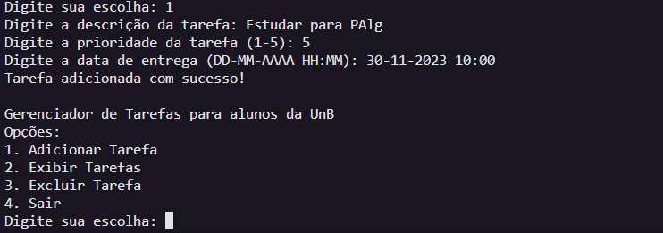
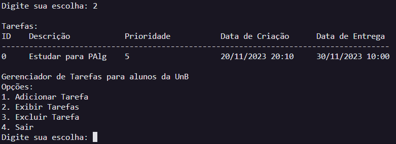
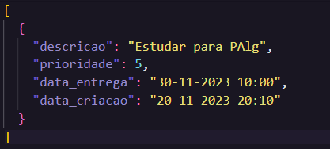

### Exercícios
#### [A - Sort an Array]() 
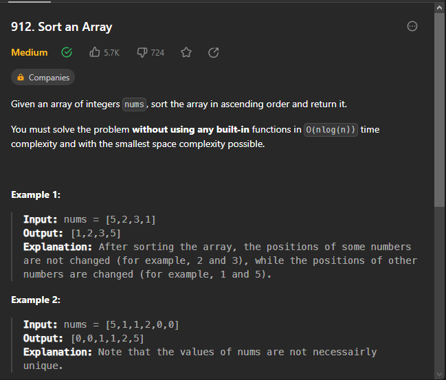
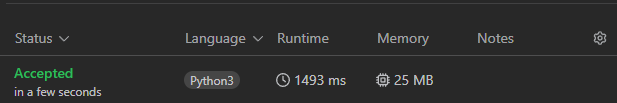

#### [B - Train Swapping](https://www.beecrowd.com.br/judge/pt/problems/view/1162) 
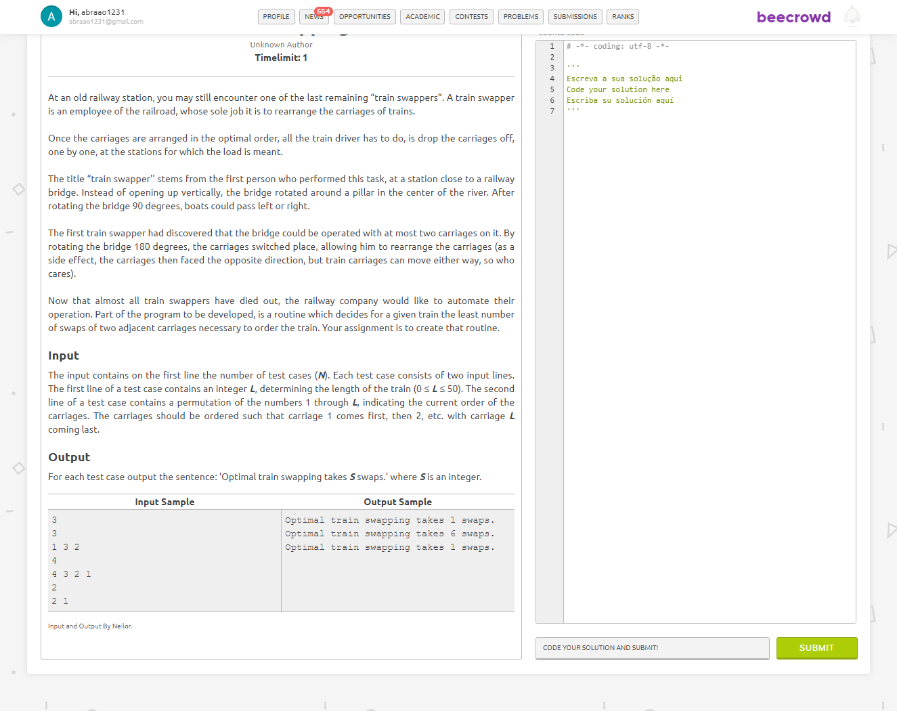
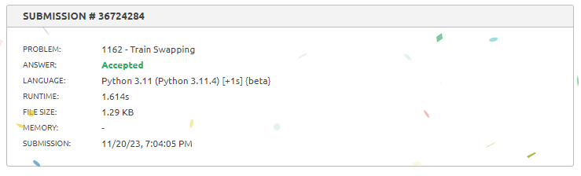

#### [C - Problema dos pares mais próximos](https://www.beecrowd.com.br/judge/pt/problems/view/1295)
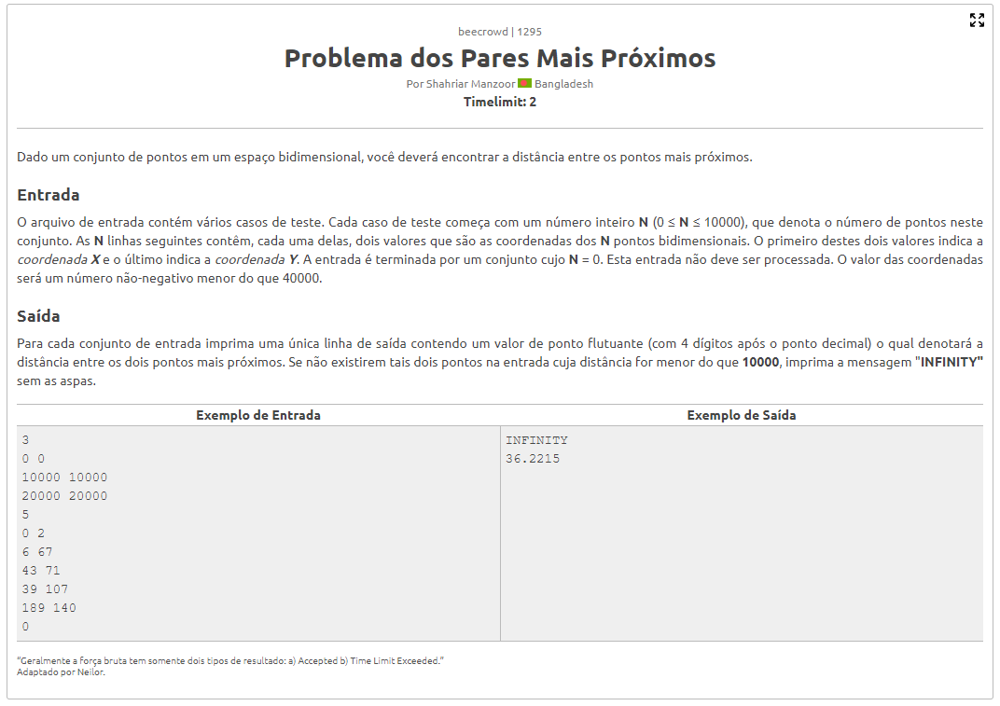
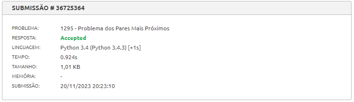

#### [D - Median of Two Sorted Arrays](https://leetcode.com/problems/median-of-two-sorted-arrays/description/)
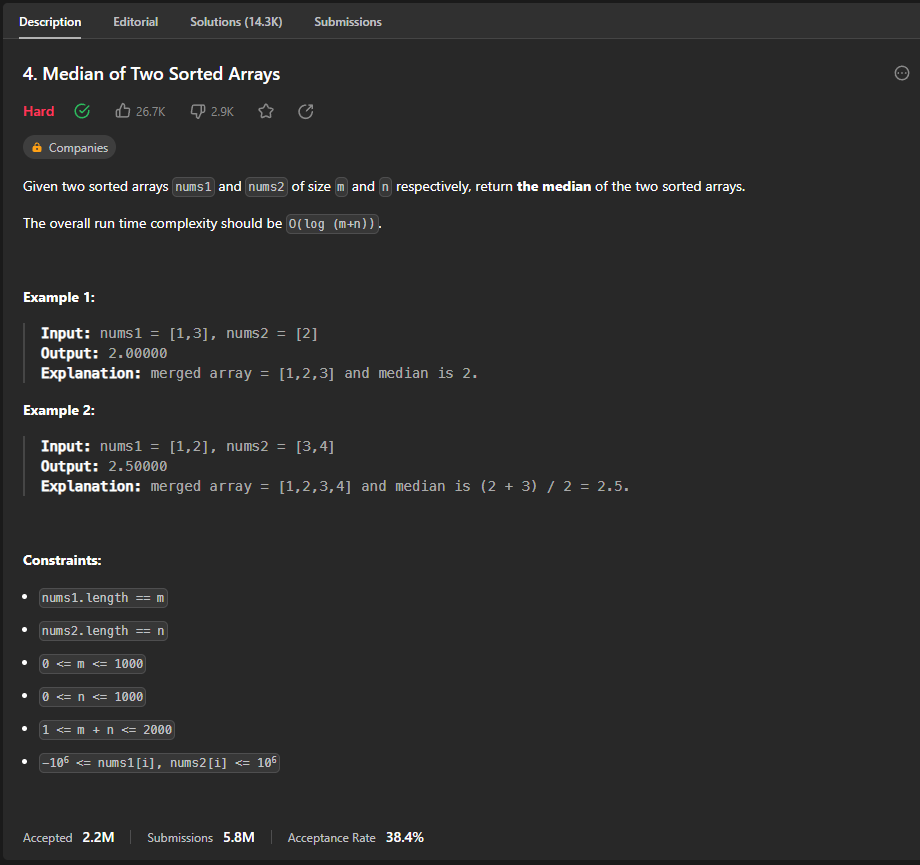
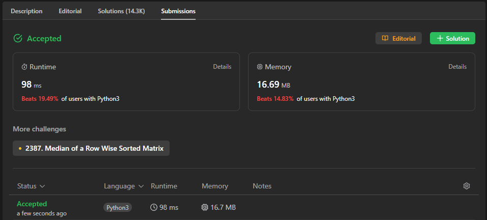

## Instalação 
**Linguagem**: Python<br>

Para executar os exercícios e o projeto Tasks, você deve ter a seguinte linguagem instalada em sua máquina:

- Python 3.x

## Uso 
Para utilizar nosso projeto, siga o passo a passo abaixo:

### Resolução de Exercícios em Juízes Online
Acesse o diretório do exercício. Para os exercícios, navegue até o diretório correspondente (A, B, C ou D).

Execute o comando Python:

``` 
$ python nome_do_arquivo.py
``` 

para executar a solução do exercício.
Substitua "nome_do_arquivo.py" pelo nome do arquivo correspondente ao exercício (A.py, B.py, etc.).

### Organizador de Tarefas (TASKS)
Acesse o diretório do projeto de tarefas. Navegue até o diretório "TASKS".

Execute o comando Python:

```
$ python task.py
``` 
para iniciar o organizador de tarefas.

Siga as instruções na interface para adicionar, excluir e visualizar tarefas.
Ao seguir esses passos, você poderá aproveitar as soluções dos exercícios e utilizar o organizador de tarefas de maneira eficiente. Certifique-se de ter o Python instalado em seu ambiente antes de executar os comandos.

## Apresentação
> - [Vídeo de apresentação](./apresentacao.rar)


